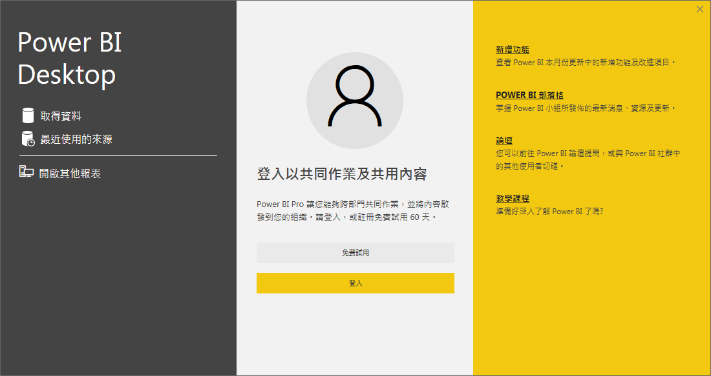
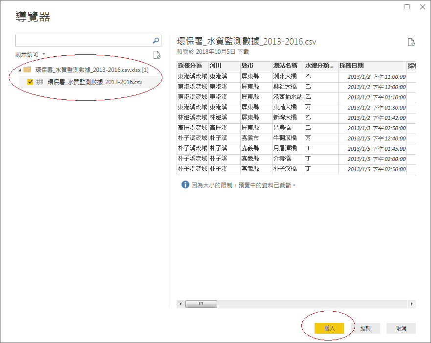
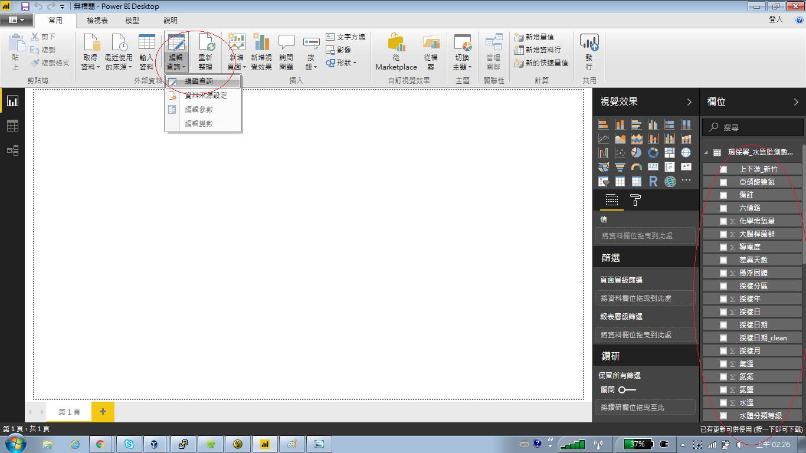
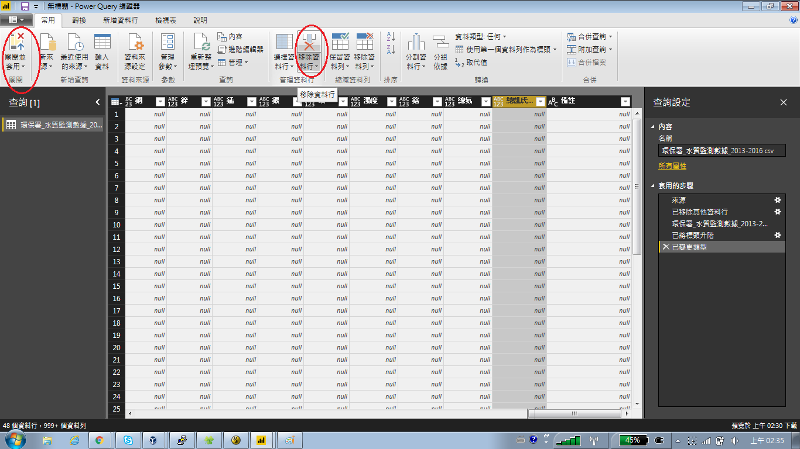
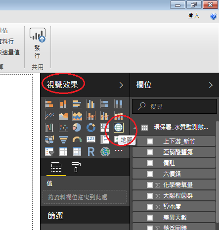
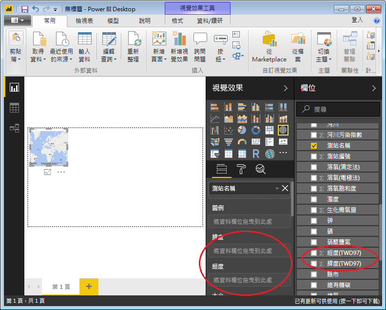
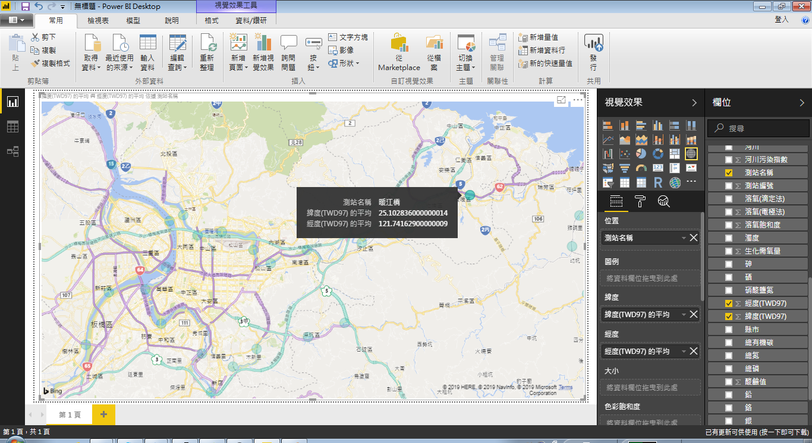
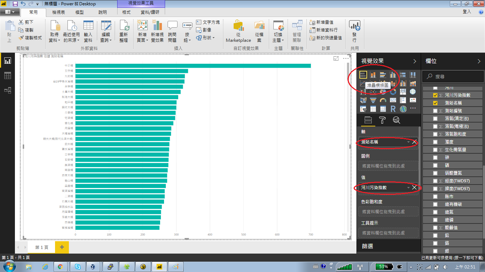

# Data Visualization by PowerBI
這是去參加 g0v summit 2018 的筆記, 主要是第一次接觸 PowerBI, 做一個操作的紀錄.

## Installation
PowerBI 可以在[這裡](https://powerbi.microsoft.com/zh-tw/desktop)下載, 可以免費使用(但功能受限 or 無法 publish).

另一個協助資料視覺化軟體[Tableau](https://www.tableau.com/)也可參考.

安裝的話, 基本上就是無腦下一步即可.

## Visualization
一開始會出現下面的畫面, 

可以註冊免費試用 60 天, 或是像我只是想試用一下也不用 publish 的話, 就直接按右上角 X 即可.

接下來選取取得資料來匯入資料. 今天我們用到的資料是來自環保署的水質監測數據, 從 2013 年到 2016 年. 這個資料可以在[這邊](https://docs.google.com/spreadsheets/d/1ZpG4EK5hbjkC6G5btb93IIi8qFnBOc_NFqqYj7TIrJw/edit?usp=sharing)下載.

選完檔案後會有導覽器跳出來, 在左邊勾選後按載入即可.

程式讀完資料後會發現在畫面右方出現了資料相關的欄位可以選擇, 我們再利用編輯查詢(Power Query編輯器)來篩選資料. 

比如說我認為總凱氏...這一欄不重要, 我就移除資料行後, 選關閉並套用.

我想要看觀測站的位置, 所以我在視覺效果這邊選了地圖.

然後我把測站名稱拖到位置, 後續經緯度也要擺對.

最後直接拖拉地圖即可得到結果.

假如我想知道那條河川污染的最嚴重, 就直接選最基本的堆疊橫條圖, 在軸這邊選測站名稱, 在值這邊選河川污染指數, 即可得到結果.

